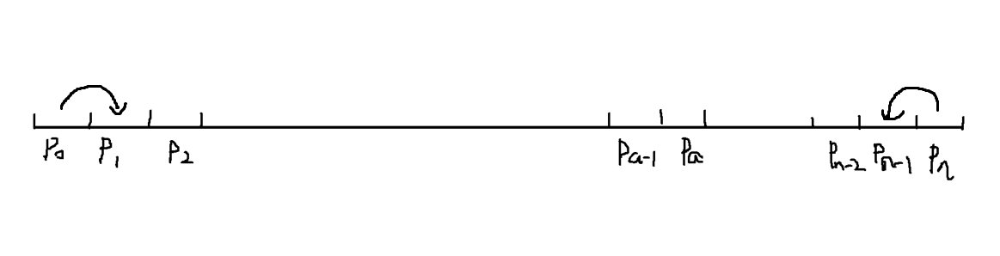
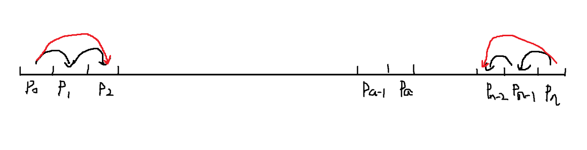
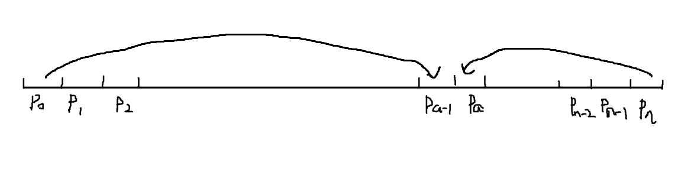
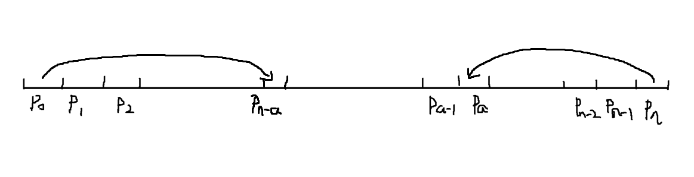
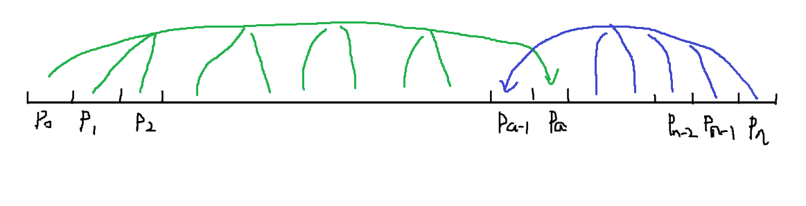

# Questionnaire-Auto-Filling

## 实现效果


## shopkeeper 的虹吸算法

对于若干个选项 A、B、C、D......，它们的得分为连续的正整数。现在给定选项的平均得分与方差，现在需要模拟出一套选项对应的概率。

首先以平均值为众数模拟三角分布算出初步的概率分布，然后需要分别从平均值、方差两个方面进行微调得到最后的概分布

平均值微调忽略

对于方差的微调，我提出了`shopkeeper的虹吸算法`，实现在维持平均值不变的情况下调大或者调小方差。以将整体方差调小为例，这个算法就如同虹吸效应一样将远离平均值的概率吸收转移到平均值附近的项目中。

### 等量虹吸

对于一系列连续的正整数 $X_{0}$ ~ $X_{n}$，设其平均值在[ $X_{a-1}$， $X_{a}$ ]之间的某个数。

一次虹吸为将位于序列两端的元素 $X_{0}$ 与 $X_{n}$ 的部分概率向内移动转移至 $X_{0+1}$与 $X_{n-1}$ 。见下图。



由于一次虹吸中转移的概率相同，所以这种方法称为等量虹吸。

同理，第二次虹吸将 $X_{1}$ 与 $X_{n-1}$ 的部分概率向内移动转移至 $X_{2}$ 与 $X_{n-2}$ 。这两次虹吸操作等价于 $X_{0}$与 $X_{n}$的部分概率向内移动转移至 $X_{2}$ 与 $X_{n-2}$ 。见下图。



每经过一次虹吸，整体的方差就会缩小。我们可以定义一轮虹吸操作，一步一步地将虹吸的概率转移至平均值附近。每一步虹吸都可以判断当前的方差是否微调至符合要求的范围。以下为伪代码说明。

```c++
float dp = 概率微调单元
for (i = 0; i < a - 1 && (n - i) > a; i++){
    P[i]-=dp;
    p[i+1]+=dp;
    p[n-i]-=dp;
    p[n-i-1]+=dp;
    auto variance = getVariance();
    if (variance<= errorPrecision){break;}
}
```

我们期待的结果是将 $X_{0}$与 $X_{n}$ 的部分概率向内移动转移至 $X_{a-1}$ 与 $X_{a}$。见下图。



然而实际上平均值等于中位数的情况并不常见，因此上面的循环会在当`i < a - 1 && (n - i) > a`这个条件不成立时终止。如下图。



经过多轮等量虹吸操作后，概率会累计在 $X_{n-a}$ 和 $X_{p}$ 处。因此提出了非等量虹吸

### 非等量虹吸

称 $X_{a-1}$ 与 $X_{a}$ 为两个`虹吸中心`。非等量虹吸的思想是，虹吸中心分别只从一侧进行概率吸取，且吸取的概率所导致的平均值变化互为相反数(可以相互抵消)。考虑特殊情况`a-1=0`或`a=n`时，虹吸中心落在概率累计函数的边缘，使得某一虹吸中心无法吸取概率的情况，现在设定虹吸中心 $X_{a-1}$ 吸取右侧( $P_{a}$ ~ $P_{n}$ ),虹吸中心 $X_{a}$ 吸取左侧( $P_{0}$ ~ $P_{a-1}$ )。见下图。



虹吸中心不同距离的概率值对平均值的贡献程度，称为贡献值。贡献值与距离成正比。

例如，对于 $P_{a}$ 而言，$P_{0}$ 的贡献值为`a-0=a`，而 $P_{a-1}$ 的贡献值为`a-(a-1)=1`。

设对于概率 $P_{x}$，其被吸取的概率微调单元为 $dp_{x}$ 。

则虹吸中心 $P_{a}$ 吸取的总概率为 $\sum_{x = 0}^{a-1} dp_{x}$ ，吸取的概率对平均值的影响 $I_{a}=\sum_{x = 0}^{a-1} dp_{x}*(a-x)$ 。

同理，虹吸中心 $P_{a-1}$ 吸取的总概率为 $\sum_{x = a}^{n} dp_{x}$ ，吸取的概率对平均值的影响 $I_{a-1}=-\sum_{x = a}^{n} dp_{x}*(x-(a-1))$

其中 $I_{a}+I_{a-1}=0$

由此可以得到非等量虹吸的虹吸过程。为了求值方便，假设对于一个虹吸中心，其虹吸的概率对应的概率微调单元 $dp_{x}$ 为常量。伪代码如下。

```cpp
float dp = Pa对应的概率微调单元
float influence=0;
float p_a=0;
for (i = 0; i < a; i++){
    P[i]-=dp;
    P[a]+=dp;
    influence+=dp*(a-i);
}

float dp_a_minus_1 = influence/((1+n-a+1)*(n-a)/2);
for (int i = a;i<=n;i++){
    P[i]-=dp_a_minus_1;
    P[a-1]+=dp_a_minus_1;
}
```

在实际操作中，还需要考虑概率必须符合[0,1]之间的限制条件。
